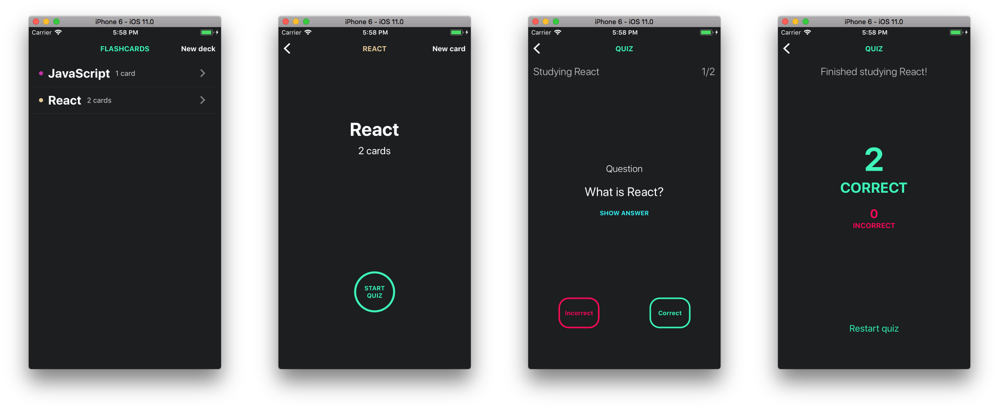

---

This project was bootstrapped with [Create React Native App](https://github.com/react-community/create-react-native-app).

Information about Create React Native App and how to use it can be found in its [README file](README_CRNA.md).

This project was made as a part of the [React Developer Udacity Nanodegree](https://www.udacity.com/course/react-nanodegree--nd019).

## To Run Locally

```bash
$ cd ~/Desktop
$ git clone https://github.com/griffinsockwell/reactnd-project-mobile-flashcards.git
$ cd reactnd-project-mobile-flashcards
```

Make sure [Node.js](https://nodejs.org/) is installed.

Install the node modules.
```bash
$ npm install
```

For iOS
```bash
$ npm run ios
```

For Android
```bash
$ npm run android
```

This app was tested on an iOS Simulator and on an Android device.
